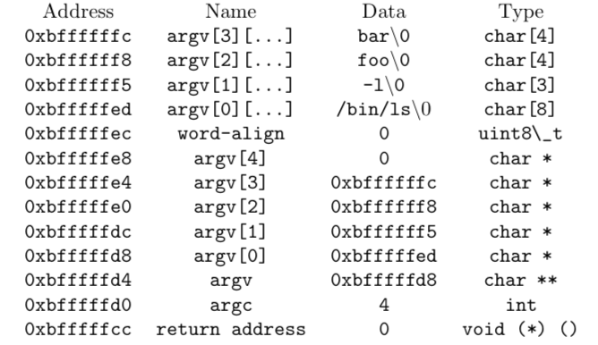
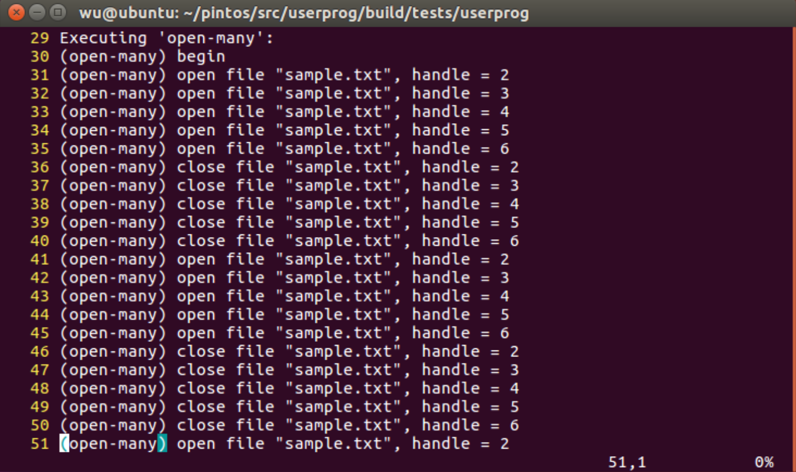
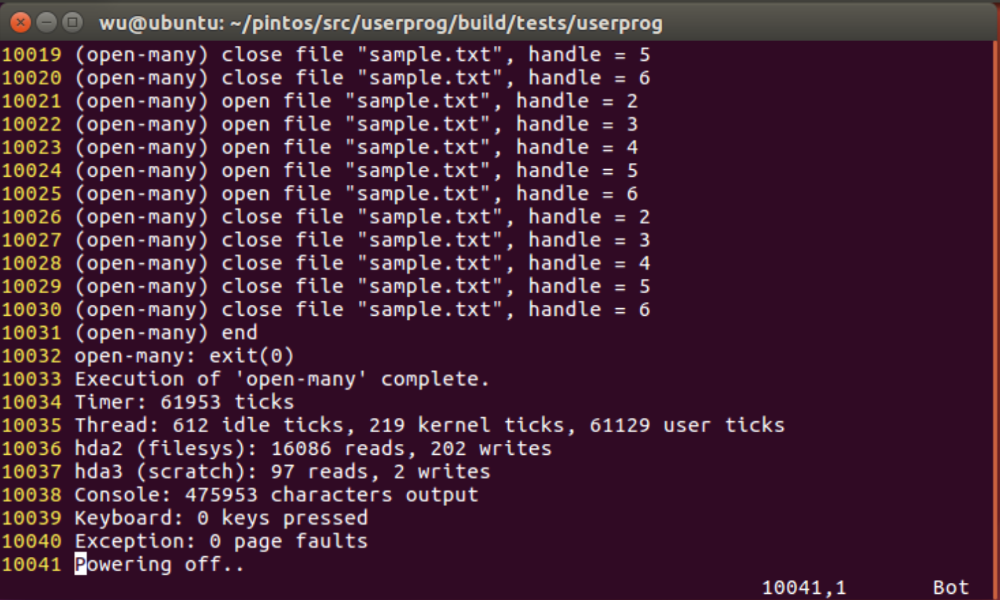
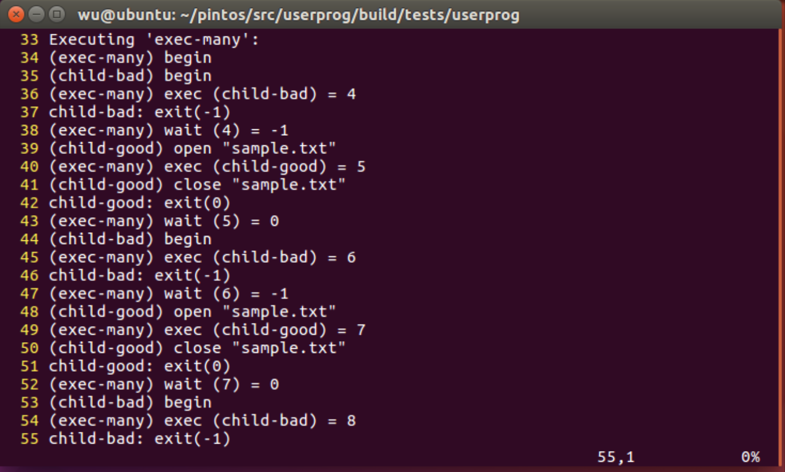
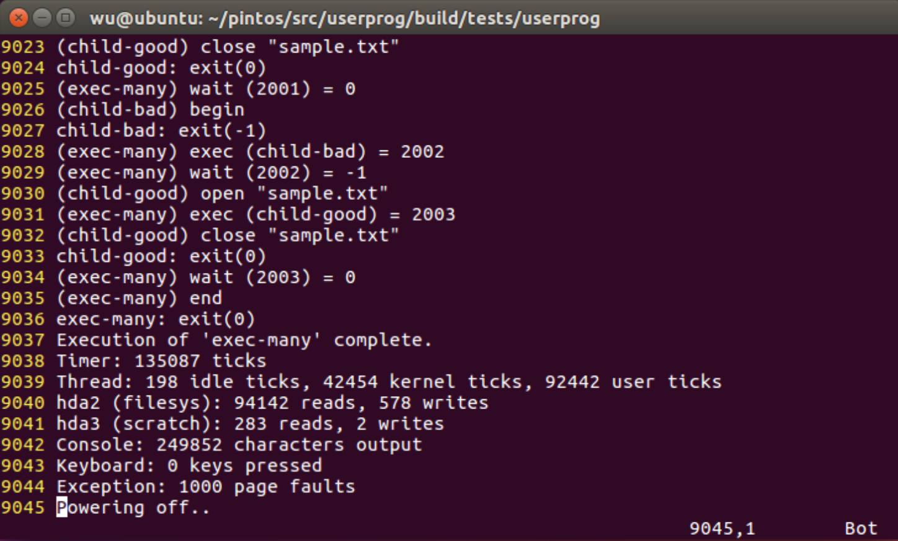

## <center>Final Report for Project 2: User Program</center>

### Group Member

* Jingrou Wu <11510281@mail.sustc.edu.cn>

Task1 design and implementation, Task 2 and Task 3 design.

* Zhihao Dai <11510415@mail.sustc.edu.cn>

Task 1 implementation, Task 2 and Task 3 design and implementation.

### 1. Design Document

In this part, we will discuss the plan for each task's implementation, including requirements, implementations, algorithms and so on.

#### 1.1 Task1: Argument Passing

##### 1.1.1 Data structures and functions

- `userprog/process.c`

  - `MAX_ARGV_SIZE 30`

  The upper boundary of the number of arguments.

  - `tid_t process_execute (const char *file_name_)`

  Using `strtok_r()` in `lib/string.c` to split the command to get and set the user progarm's name.

  - `bool load (const char *arguments, void (**eip) (void), void **esp)`

  Split the command line arguments and store it in the `char* argv[]` and call `push_stack()`.

  - `void push_stack (void **esp, int argc, char **argv)`

  Push arguments into the stack.

- `threads/thread.h`
  - `struct thread`
    - `process_file`

    pointer to the executable file.

##### 1.1.2 Algorithms

We review the **original implementation** in Pintos and describe **new implementation** in this part.

##### 1.1.2.1 Original Implementation

In the user program part, after the kernel is started, a new thread to load user program is created with the function `start_process(void *filename)` .

Then it initializes interrupt frame and loads executable file according to the `filename`.

After that, it starts the user process by simulating a return from an interrupt, implemented by `intr_exit` which pushes all arguments to the stack stored in the struct `intr_frame`.

##### 1.1.2.2 New Implementation

Based on the understanding about how the user program is excuted, we modify the code by 2 steps.

###### 1.1.2.2.1 Parsing Arguments (`userprog/process.c`)

Since the argument `filename` including the excutable file and the arguments, we need to split them. In the pintos's `lib`, the function, `strtok_r(char *,const char *,char **)`, used to split string is included in the c file `string.c`. Using it, we could get the actual excutable file's name which is used to name the new user process.

In the function `start_process(void *file_name)`, after initialization, the excutable file should be loaded by the function `load`.

In the function `load`, we split the command line arguments and store them in the `char* argv[]`. Then, push these arguments from right to left into the stack using the newly created function `push_stack(esp,argc,argv)`.

###### 1.1.2.2.2 Pushing arguments into the stack(`userprog/process.c`)

Function `push_stack(esp,argc,argv)` pushes these elements as the figure 1 shows, where `esp` is the stack point, `argc` is the total number of arguments and `argv` stores all the arguments.



<center>Figure 1 push_stack()</center>

##### 1.3 Synchronization

When we load the user program, we should load the process's file. Since, the file system in Pintos is not thread-safe, we should use `filesys_lock` to keep the process's file from being modified while opening it. Once, the file is loaded successfully, we should use this lock agian to deny wirte to the file using `file_deny_write`.

##### 1.4 Rationale

We use `process_file` to record pointer to the excutable file to open and load it. Also, we split arguments and push them into the stack to record the arguments.

#### 1.2 Task2: Process Control Syscalls

##### 1.2.1 Data structures and functions

- `userprog/syscall.c`
  - `void pop1 (void *esp, uint32_t *a1)`

  Pop one argument off the stack by `esp`.

  - `void pop2 (void *esp, uint32_t *a1,uint32_t *a2)`

  Pop two arguments off the stack by `esp`.

  - `void pop3 (void *esp, uint32_t *a1, uint32_t *a2, uint32_t *a3)`

  Pop three arguments off the stack by `esp`.

  - `uint32_t dereference (uint32_t *addr)`

  Return the page which the address pointers to.

  - `void _exit (void *esp)`

  System call EXIT.
  - `void _halt (void *esp)`

  System call HALT.

  - `int _exec (void *esp)`

  System call EXEC.

  - `int _wait (void *esp)`

  System call WAIT.

  - `int _practice (void *esp)`

  Add one to its first argument and return the result.

- `userprog/process.c`
  - `void process_thread_exit (int status)`

  The exit function for the user program.

  - `tid_t process_execute (const char *file_name_)`

  Make another copy of `FILE_NAME`. Insert child process information into the `children_list`.

  - `int process_wait (tid_t child_tid) `

  Wait for thread TID to die and returns its exit status.

- `threads/thread.h`
  - `struct thread`:
    - `struct list children_list`

    This is a list of child process.
    - `struct child_process *process_ptr`

    This is a pointer to the child process information.

    - `struct semaphore loaded_sema`

    This semaphore is for load.
    - `bool loaded`

    It is to record whether the process is successfully loaded.

  - `struct child_process`:
    - `struct list_elem children_elem`

    This is the list element for list of children of the process. It is easier for operators in the `list`.

    - `tid_t tid`

    Record the process's thread id. (*Since, in Pintos, the process id and the thread id is one-to-one*).

    - `struct semaphore semaphore`

    This is for synch.

    - `bool waited`

    It is to record whether the child process has been waited for.

    - `struct thread *thread`

    It is a pointer to the child thread.

    - `int exit_status`

    It records the exit status of the process.

- `threads/thread.c`
  - `struct thread * thread_find (tid_t tid)`

  Find the thread by tid.

  - `static void init_thread (struct thread *, const char *name, int priority)`

  Initialize `children_list` and `loaded_sema`.

##### 1.2.2 Algorithms

We review the **original implementation** in Pintos and describe **new implementation** in this part.

##### 1.2.2.1 Original Implementation

There are only two functions in the `syscall.c `. One is `sys_init(void)` which initializes the system call to register it into the `intr_frameand`, while another is `syscall_handler(struct intr_frame *f UNUSED)`.

In this task, we need to implement 4 system call functions, `halt`, `exec`, `wait` and `practice`.

In `userprog/syscall.c`, `syscall_handler` will assign those 4 system calls to `_halt()`, `_exec()`, `_wait()`, `_practice()` defined in `userprog/syscall.c` respectively.

##### 1.2.2.2 Function `_halt(void *esp UNUSED)`

This function is to turn off the pintos. Since there is a function called `shut_down_power_off` to shut down the system, we just call it in this funtion to implement it.

##### 1.2.2.3 Function `_exec(void *esp)`

This function is called to exectue a new process.

Firstly, we should use `pop1(esp,(unit32_t *)&file))` to get the 1 argument off the stack by `esp`. Then, we check if it is  valid using the function `is_user_vaddr(const char*)`. If it is not valid, return -1. Otherwise, we call `process_execute(const char *file_name)` to execute the new process.

After that, we need to check whether it is executed correctly (`if (tid == TID_ERROR)`), whether the thread could be found and if it is loaded successfully (`if (!(thread->loaded))`).

Finally, if the child process works well, we return the thread ID `tid`.

- Modifictions of `process_execute(const char *file_name)`
  - Make another copy of `FILE_NAME`. Otherwise there's a page fault when executing `exec()`.
  - Disable the interruption before create a child process. Otherwise, the child process may start before the parent insert the info into children_list. If that happens, the child process's process_ptr will be NULL and will not be able to save its exit status when it exits. That is, the parent will "lose" the child's info.
  - Insert child process information into the `children_list`. Firstly, we create the new thread, and then, check whether it is illegal. If not, we initilize the struct `child process` and insert it into the `children_list`.
- Definition of `struct child_process` in `threads/thread.h`
- Modifictions of `struct thread` in `threads/thread.h`
- Function `thread_find(tid_t tid)` in `threads/thread.c`
  - This is to find the thread by `tid`. If it is found, just return the thread with `tid`, otherwise, return NULL.
- Modifications in `init_thread(struct thread *t, const char *name, int priority)` in `threads/thread.c`

  Since we have add more attributes in the struct `thread`, we should initilize these new attributes as well.

  - `children_list`

  We should use `list_init (&(t->children_list))` for initialization.
  - `loaded_sema`

  We also initilize the semaphore using `sema_init (&(t->loaded_sema), 0)`.

##### 1.2.2.4 Function `_wait(void *esp)`

Similarly, we firstly get the process id `pid` of the process which is called to wait. Then we call `process_wait(tid_t child_tid)`.

- `process_wait(tid_t child_tid)` in `usrprog/process.c`

We rewrite the code in this function.

Firstly, we find the child process (`struct child_process`) with `child_tid` in `list children_list`. If the child process if not found, returns -1. If the child process is found but has been waited, that is, `bool child_process.waited` is true, returns -1.

Otherwise, we set `bool child_process.waited` to true and `sema_down` on `child_process.semaphore`


##### 1.2.2.5 Function `_practice（void *esp）`

This function is to add 1 to first argument. Hence, we firstly use `pop1(void *esp, uint32_t *a1)` to get the first argument, add 1 to it and return it.

##### 1.2.2.6 Function `_exit(void *esp)`

The main function to call is `process_thread_exit(int status)`.

- `process_thread_exit(int status)`

In this function, we free all `struct child_process` allocated for children_list. Then, we call `thread_exit()` which has been originally implemented in the `threads/thread.c`.

##### 1.2.3 Synchronization

- `wait()`

  In `process_wait`, we use `semaphore` to avoid race condition. That is, whenever there is a child is been waiting, we use `sema_down` to indicate the parent thread to wait for it.

  Meanwhile, in `process_thread_wait`, we `sema_up()` to wake up its parent.

- `exec()`

  When the parent calls `exec()` system call, it calls `process_execute()`, essentially, `start_process()` first, then downs the newly introduced `semaphore loaded_sema` in `struct thread` of the child process.

  Once the child process finishes loading, its load result is saved into `bool loaded` and `loaded_sema` is upped, thus waking up the parent blocked in `exec()`.

##### 1.2.4 Rationale

Firstly, we use `pop` to get the arguments we want. Then, we call other functions to realize the system calls. In these procedure, we also give insignt into **synchronization**.

#### 1.3 Task3: File Operation Syscalls

##### 1.3.1 Data structures and functions

- `userprog/syscall.c`
  - `struct file **init_opened_files (void)`

  Record files has been opened.

  - `bool is_fd_valid (int fd, struct file **file)`

  Check whther the file descirptor is valid or not.

  - `bool _create (void *esp)`

  Create a file.

  - `bool _remove (void *esp)`

  Remove a file.

  - `int _open (void *esp)`

  Open a file.

  - `int _filesize (void *esp)`

  Return the file's size.

  - `int _read (void *esp)`

  Read the file.

  - `int _write (void *esp)`

  Write something to the file.

  - `void _seek (void *esp)`

  Change the file's writing and reading position.

  - `unsigned _tell (void *esp)`

  Return the file's writing and reading position.

  - `void _close (void *esp)`

  Close a file.

- `userprog/syscall.h`
  - `struct lock filesys_lock`

  Lock for synchronizing the File System Calls.

- `userprog/process.c`
  - `process_thread_exit`

  Close the executable file of the process so that it may become writeable. Close all the files the process has opened and free the array of opened files and free the page allocated for `opened_files` and update process info.

- `userprog/exception.c`
  - `page_fault(struct intr_frame *f)`

  Release `filesys_lock` while there is an exception.

- `threads/thread.h`
  - `struct thread`
    - `struct file **opened_files`

    Record the filse has been opened by this thread.

- `threads/thread.c`
  - `init_thread(struct thread *t, const char *name, int priority)`

  Initialize `opened_files` and `process_file`.

##### 1.3.2 Algorithms

##### 1.3.2.1 Function `_create(void *esp)`

To create a file, we need two arguments `const char *file` and `unsigned initial_size` to call the function `filesys_create(const char* file, unsigned initial_size)` which has been implemented in the pintos's file system.

Hence, firstly, we use `pop2(void *esp, uint32_t *a1, uint32_t *a2)` to get these arguments from the user program stack.

Acquire the lock `filesys_lock`. Then, we call `filesys_create`. Release `filesys_lock`.

##### 1.3.2.2 Function `_remove(void *esp)`

Similar with the function `_create`, but this time, we just need one argument `const char* file`, which indicate the file's name to be removed, to remove the file.

After we get it using `pop1`, we acquire `filesys_lock`, call `filesys_remove(const char* file)` and release the lock after.

##### 1.3.2.3 Function `_open(void *esp)`

Firslt, we get one argument from the stack. Then, we initialize the current thread's `struct file **opened_files`, if it dose not initialize. That is, this file is the first file that the thread opens.

To initialize `opened_files` is to allocate a new page to it. After initilization, we acquire `filesys_lock`, call `filesys_open(const char* file_name)` and release after.

If we could not open the file, we return `file_descriptor` with value of -1. Otherwise, find the first NULL element in `opened_files` such that we can allocate the index as a file descriptor to the file. If such element does not exist, return -1.

- `struct file **opened_files` in `threads/thread.h`

Introduced `opened_files` for File System Calls, which is **an array for storing File Descriptors**. It will not been allocated memory until the first time `_open()` is called, as we mentioned before.

##### 1.3.2.4 Function `_filesize(void *esp)`

This function is to return the size of the file.

First, we get the index/file descriptor `int fd`. Then, we use newly-written function `is_fd_valid (int fd, struct file **file)` to check whether the fd is valid for the current process. There are several cases that it could not pass the check.

- `fd` is not in the range.
- The thread's `open_files` is NULL.
- There is no such file in the `opened_files`.

Finally, we acquire `filesys_lock`, call `file_length` to get the file's size and release after.

##### 1.3.2.5 Function `_read(void *esp)`

At this time, we need 3 arguments from the stack using the function `pop3(void *esp, uint32_t *a1, uint32_t *a2, uint32_t *a3)`.

These arguments are file descriptor, buffer and size respectively.

Firstly, we call `is_user_vaddr (const void *vaddr) ` in `threads/varr.h `to check whether buffer is valid user address. If not, exit the thread with `status` -1. There are several case according to different valuse of file descriptor.

- If `fd==0`: It means that we should read from the keyboard using `input_getc()` in `devices/input.c`. So we read the character with the number of `size` into the `buffer` and return `size`.
- Otherwise, we read it from the file. Similarly, we should check if `fd` is valid, and then call function `file_read (struct file *file, void *buffer, off_t size) ` in `filesys/file.c` and return the bytes that have been read.

`filesys_lock` is acquired before `file_read()` is called and released after.

##### 1.3.2.6 Fuction `_write(void *esp)`

Similar with the function `_read`, we need 3 arguments from the stack, `int fd`, `const void *buffer` and `unsigned size`. Then, check whether buffer is valid user address. If not, exit the thread with `status` -1.

- If `fd==1`: It means that we should write to the console. We call `putbuf(const char *buffer, size_t n)` in `lib/kernel/console.c` to do that.
- Otherwise, we write to the corresponding file using `file_write(struct file *file, void *buffer, off_t size)` in `filesys/file.c`.  Before that ,we check the validity of `fd`.

`filesys_lock` is acquired before `file_write()` is called and released after.

Finally, we return `bytes_written`.

##### 1.3.2.7 Function `_seek(void *esp)`

We need two arguments in this function, `int fd` and `unsigned position`. We check the validity and then acquire `filesys_lock`, call `file_seek(struct file *file, off_t new_pos)` to change the file's next byte to be read or written position, and then release `filesys_lock`.

##### 1.3.2.8 Function `_tell(void *esp)`

We only need one argument now, `int fd`. We check the validity and then acquire `filesys_lock`, call `file_tell` in `filesys/file.c` to get the current position, and then release `filesys_lock`.

##### 1.3.2.9 Function `_close(void *esp)`

To colose some file, we only need one argument, `int fd`. Check the validity and find the file. Eventually, acquire `filesys_lock`, call `file_close(struct file *file)` to colse it and release `filesys_lock` after.

##### 1.3.2.10 More implementations

Apart from the modifications above, we also need to change other codes in Pintos to run it.

- `userprog/syscall.h`
  - `struct lock filesys_lock`

  To keep thread-safe while using filesystem, we add `struct lock filesys_lock` to lock for **synchronizing** the File System Calls.
- `userprog/syscall.c`
  - Function `dereference(uint32_t *addr)`: While pop arguments off the stack by `ESP`, we use this function to get the pointer.

  Definitely, we should use `is_user_vaddr (const void *vaddr)` in `threads/vaddr.h` to check if VADDR is a user virtual address.

  Then, we get and return the `page` with the fuction `pagedir_get_page (uint32_t *pd, const void *uaddr)` in `userprog/pagedir.c` to look up the physical address that corresponds to user virtual address `UADDR` in `PD` and return the kernel virtual address corresponding to that physical address, or a null pointer if `UADDR` is unmapped.

  - Function `syscall_handler (struct intr_frame *f)`: Since we have implemented different system calls, we should modify the `syscall_handler` to handle different system calls. We use `switch case` to deal with it.

- `userprog/process.c`
  - `process_thread_exit`

  Since we have implemented file operation sys calls, we should close the executable file of the process so that it may become writeable. Meanwhile, we should close all the files the process has opened and free the array of opened files and free the page allocated for opened_files and update process info.

  - `load()`

  We use lock to thread-safely open the excutable file. Once loaded, we deny write access to the excutable file and close it.

- `userprog/exception.c`
  - `page_fault(struct intr_frame *f)`

  As `process_thred_exit()` makes use of `filesys_lock` to release the process's resouces. If, unfortunately, an exception happens during the file system access, we should first release the `filesys_lock` held by the current thread.

- `threads/thread.h`
  - `struct thread`

  As for file operation syscalls, we add `struct file **opened_files` to record the filse has been opened by this thread. We also add `struct file *process_file` to record the executable file of the process in order to it could not be modified while excuting.

- `threads/thread.c`
  - `init_thread(struct thread *t, const char *name, int priority)`

  Since we have updated the `struct thread`, we should initialize `opened_files` and `process_file` as well.

##### 1.3.3 Synchronization

Since Pintos file system is not thread-safe, before every call of the filesystem functions, we need get the `filesys_lock`, and after calling, we should release the lock.

##### 1.3.4 Rationale

We implement file operator system calls and use `filesys_lock` to keep thread-safe. We also use `open_files` to record all the files.

#### 1.2 Tests analysis

##### 1.2.1 Tests with invalid stack pointer

- `bad-jump`

One of the tests that uses invalid stack pointer is `bad-jump.c` which attempts to execute code at address 0, which is not mapped. Since we have called `is_user_vaddr` before we handle with the pointer, we pass these test cases.

##### 1.2.2 Tests with a valid pointer close to a page boundary

- `sc-boundary`, `sc-boundary-2`, `open-boundary`, `read-boundary`, `write-boundary`

`boundary.c` is the test that uses a valid pointer close to a page boundary. Utility function for tests that try to break system calls by passing them data that crosses from one virtual page to another.

##### 1.2.3 Test Uncoverage

There is no test for the system call function `practice`.

- `practice`

Hence, we write down a test case `practice` to test it. In this test case, we call system call `practice`, starting from `i=1` to `i=1000` to see if the result equls to inpute plus one.

### 2. Hack Testing

In this project, it requires us to submit 2 new test cases, which exercise functionality that is not covered by existing tests. In this part, we will dicuss 2 new test cases in more detail.

#### 2.1 `tests/userprog/open-many.c` and `tests/userprog/open-many.ck`

##### 2.1.1 Description of the Feature

This test tests if the system **releases memory/pages** for file descriptors in time every time after the file closed.

##### 2.1.2 Overview of the Mechanics

In a single process, we open (calling syscall `open(file_name)`) 5 files each time and close (calling syscall `close(file_name)`) them and repeat it for 1000 times to see if there is a **page fault** when the process has to assign new file descriptors to the newly opened files.

##### 2.1.3 Output



<center>Figure 4 Open Many Output 1</center>



<center>Figure 5 Open Many Output 2</center>

##### 2.1.4 Potential kernel bug

Failure might happen even when currently there are relatively few opened files (say 5), if the array (or other data structure) for storing the file descriptors has no boundary and no reuse.

A process should be able to call `open()` as many times as it wants, as long as it do not exceed the limit of opened files.

#### 2.2 `tests/userprog/exec-many.c` and `tests/userprog/exec-many.ck`

##### 2.2.1 Description of the Feature

Execute a "bad" child and a "good" one many times to test whether the kernel frees all the resouces of the thread (process) when it exits.

##### 2.2.2 Overview of the Mechanics

For each time, the parent process run a bad child process and a good process and repeat for 1000 times. Since `child-bad.c` has been implemented in the original Pintos, we only need to implement `child-good.c`.

- `tests/userprog/child-good.c`

  Child process run by opening a file. This is to test if it could run a child process without any problems.

##### 2.2.3 Output



<center>Figure 6 Exec Many Output 1</center>



<center>Figure 7 Exec Many Output 2</center>

##### 2.2.4 Potential Kernel Bugs

A parent should be able to repeat this process as many as times as it wants, being assured that the kernel will free all the resouces allocated for the previous children. If it could not pass this test case, it means that the kernel did not free all the resources after the child is killed.

#### 2.3 Reflection

- What can be improved about the Pintos testing system? (There’s a lot of room for improvement.)

  Running large test cases like `multi-oom`, `exec-many` and `open-many` may take a lot of time. If the testing system can be ran in multiple threads, as many computers nowadays are multi-thread, that could be huge boost to the testing procedure.

- What did you learn from writing test cases?

  I learnt that writing test cases is not only essential to writing softwares, but also to operating systems. Writing simple test cases to test different functionalities of the system under normal circumstances is far from enough.

  As a programmer, we must write test cases that push the system to its limit and sometimes to face "the very unlikely" that could happen.

### 3. Reflection

#### 3.1 What did each member do

Zhihao DAI is responsible for implementing Task 1, designing and implementing Task 2 and Task 3 and test cases.

Jingrou Wu is responsible for understanding the userprog part in Pintos, designing and implementing Task 1, designing Task 2 and Task 3, fixing bugs and writing the report.

#### 3.2 What went well and wrong

We pass all the 79 (76 offered by Pintos, 2 for Hack Testing and 1 for system call `practice`)tests.

To have a clear view of how we have done with tasks, we change the order to implement  them. Since, if we do not implemented the system call`wait`, we could never get the real result. Hence, we firslt implemented Task 1 and part of Task 2, and finally all of Task 2 and Task 3.

The most difficult test is `multi-oom` which recursively executes itself until the child fails to execute and it expects that at least 30 copies can run.

If we do not release all the resources in time, it will fail. To pass this tese, we modify our codes more carefully, especially for resource release.

Moreover, the synchronization also needs considering because file system in Pintos is not thread-safe. Hence, we use `filesys_lock` to maintain it.

Through these tests, we've learned that dealing with operating system codes, we should consider more for something that is rarely considered in the user program inculing synchronization and resource release and so on.

### 4. Problems and Solutions

- Does your code exhibit any major memory safety problems (especially regarding C strings), memory leaks, poor error handling, or race conditions?

In the current version, there is no obvious problems with memory safety, memory leaks, poor error handling and race conditions.

- **Memory safety and leaks**
  - In the former version, we do meet with these problems due to inappropriate operator with C strings. Problems like NULL POINTER, STACK OVERFLOW did happens.
  - **Solution**: Thanksfully, we enforce the check of pointer and memory to solve this problem.
- **Poor error handling**
  - In the former version, we forget to release file lock while there is an exception in the file system.
  - **Solution**: Currently, we have fixed this proble by releasing `filesys_lock` in `uerprog/exception.c`'s function `page_fault (struct intr_frame *f)`.
- **Race conditions**
  - This is the major problem during testing, since once it happens, the output will be very different and confused.
  - **Solution**: Whenever there is a file operator, we add lock to ensure thread-safe. We also deny writting while the excutable file is running to avoid thread choas.

- Did you use consistent code style? Is your code simple and easy to understand? If you have very complex sections of code in your solution, did you add enough comments to explain them?

    Our code is consistent with the exisiting Pintos code style and easy to understand. For those codes a little difficult for understanding, we add enough comments to explain them.

- Did you leave commented-out code in your final submission?

    No.

- Did you copy-paste code instead of creating reusable functions?

    In this project, instead of re-implementing linked list algorithms, we using them directly.

- Did you re-implement linked list algorithms instead of using the provided list manipulation?

    We try to create as many as reusable functions (e.g. `pop1()`, `pop2()`, `pop3()` in `userprog/syscall.c` to pop 1, 2, 3 arguments off the stack) as possible to keep our code short and tidy.

- Are your lines of source code excessively long? (more than 100 characters)?

    We try to keep our lines of code as short as possible. If there are excessively long lines, we may divide them into several lines.

### 5. Conclusion

Through this project, we have learnt the real-world implementations to system calls in Pintos and how to synchronize between different processes.

We have made a careless mistake when implementing the file system calls as we do not acquire `filesys_lock` before accessing Pintos file system.
The mistake has cost us huge amount of debugging time, especially debugging the test `multi-oom`, before we finally located the synchronization problem.

Synchronization is one of the most important (also the most dangerous) issues in Operating System, which we learnt in a hard way. As we dives deeper into this topic, our understanding of the operating system also grows deeper.

In this project, we **changed 24 files, added 1071 insertions(+) and removed 27 deletions(-)**.

```sh
git diff --stat 933b1b846ecc8440fedf9423e52d61600e30e3a7
 .travis.yml                        |  15 ++
 README.md                          |  71 +++++++
 README.txt                         |   2 -
 install.sh                         |  18 ++
 src/lib/syscall-nr.h               |   1 +
 src/lib/user/syscall.c             |   6 +
 src/lib/user/syscall.h             |   1 +
 src/tests/threads/alarm-priority.c |   8 +-
 src/tests/userprog/Make.tests      |  14 +-
 src/tests/userprog/child-good.c    |  15 ++
 src/tests/userprog/exec-many.c     |  39 ++++
 src/tests/userprog/exec-many.ck    |   8 +
 src/tests/userprog/open-many.c     |  49 +++++
 src/tests/userprog/open-many.ck    |   8 +
 src/tests/userprog/practice.c      |  19 ++
 src/tests/userprog/practice.ck     |   8 +
 src/threads/init.c                 |   9 +-
 src/threads/thread.c               |  40 +++-
 src/threads/thread.h               |  73 +++++++
 src/userprog/exception.c           |  15 ++
 src/userprog/process.c             | 244 ++++++++++++++++++++-
 src/userprog/process.h             |   2 +
 src/userprog/syscall.c             | 425 ++++++++++++++++++++++++++++++++++++-
 src/userprog/syscall.h             |   8 +
```
